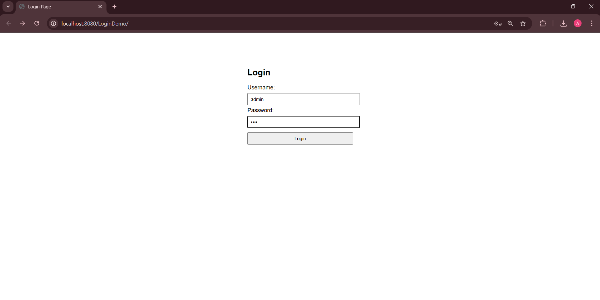
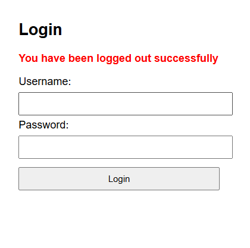

# Login Authentication & Logout System (Assignment 1)

This project implements a **Login and Logout system** using **Java Servlets and JSP**.
It demonstrates basic authentication, session management, and request handling
using Java EE technologies.

---

## 🔧 Technologies Used
- Java (JDK 8 / JDK 17)
- Java Servlets
- JSP (Java Server Pages)
- Apache Tomcat 9
- Eclipse IDE
- Git & GitHub

---

## ✨ Features
- User login with username and password
- Hardcoded authentication check
- Session creation using HttpSession
- Welcome page after successful login
- Logout functionality with session invalidation
- Error handling for invalid credentials or session expiry

---

## 🔑 Login Credentials
Username: admin
Password: 1234

---

## 📂 Project Structure
LoginDemo
├── src
│ └── main
│ ├── java
│ │ └── com
│ │ └── demo
│ │ ├── LoginServlet.java
│ │ └── LogoutServlet.java
│ └── webapp
│ ├── index.jsp
│ ├── welcome.jsp
│ ├── error.jsp
│ └── WEB-INF
│ └── web.xml

---

## ▶ How to Run the Project
1. Import the project into **Eclipse IDE**
2. Configure **Apache Tomcat 9** as the server
3. Set Java version to **Java 8 or Java 17**
4. Run the project using **Run on Server**
5. Open browser and visit:
http://localhost:8080/LoginDemo/index.jsp

---

## 🖼 Screenshots

### Login Page

### Welcome Page

### Logout / Error Page

---

## 🚫 GitHub Pages Limitation
This project **cannot be hosted on GitHub Pages** because GitHub Pages only supports
static websites. Java Servlets and JSP require a server like **Apache Tomcat** to run.

---

## 📌 Assignment Note
This project was created as **Assignment 1** to demonstrate the use of:
- Servlets
- JSP
- Session Management
- RequestDispatcher
- Basic authentication flow

---

## 👨‍🎓 Author
**Arjun Singh**
